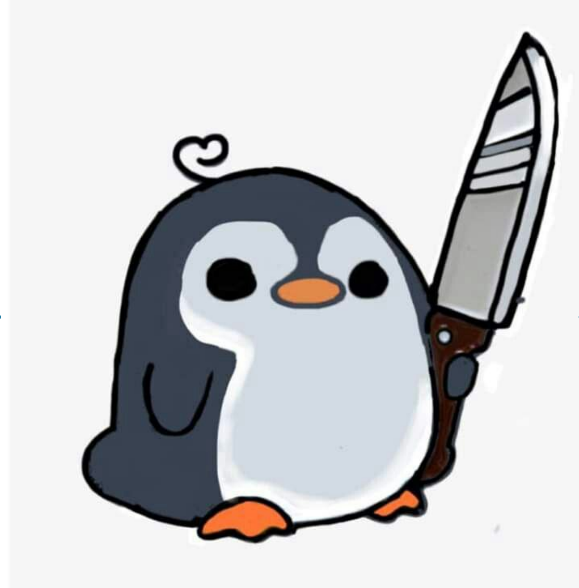
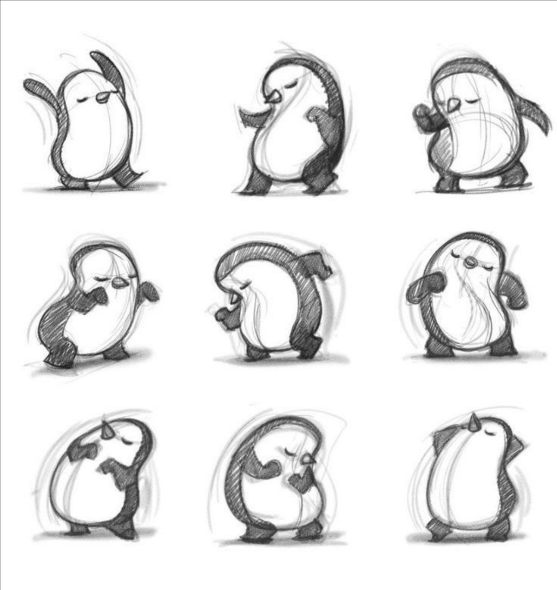
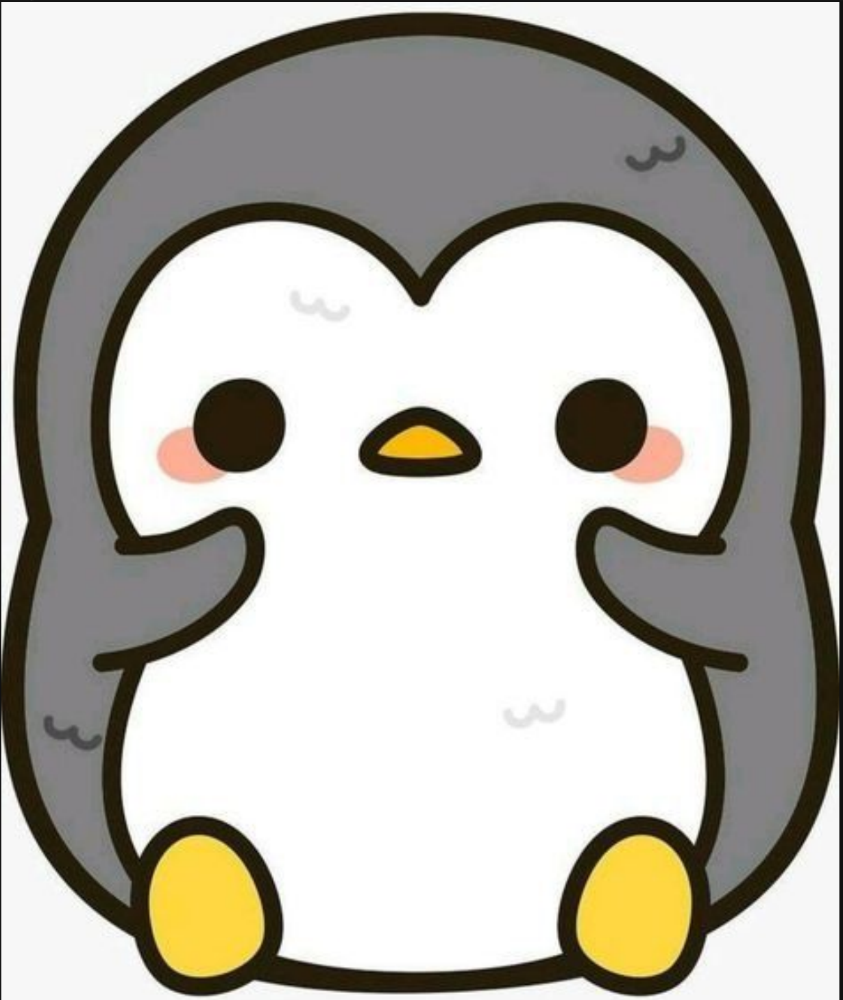
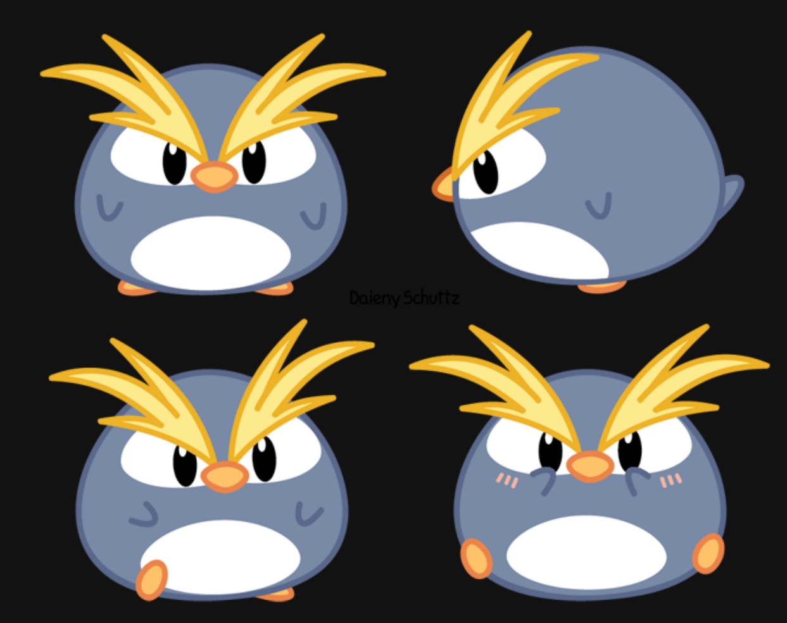
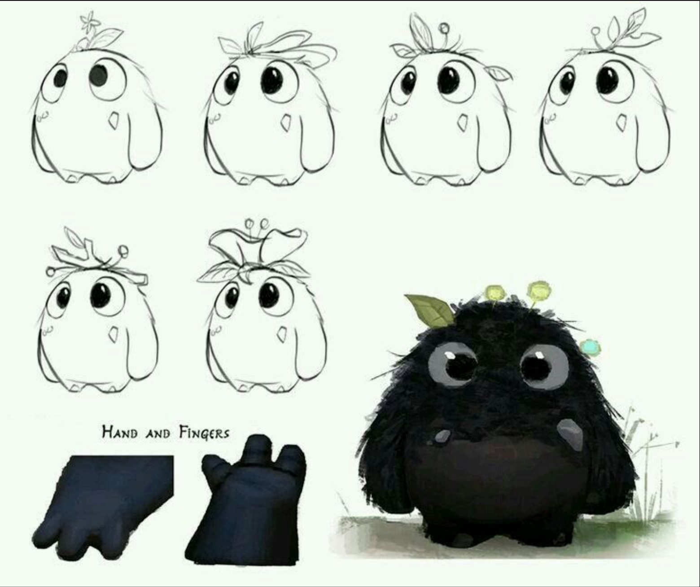
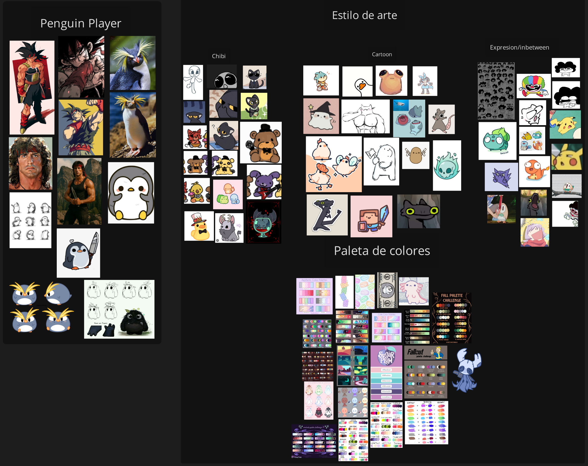

# Player
#### Moodboard del Player, este siendo un pingüino. Las 5 propuestas van más a cuestión de la forma en que entra en el juego.

1- Forma tanto chibi como cartoon, con extremidades no tan largas, más cortas que largas, para darle un sentido algo tierno.

2- Forma más cartoon, con extremidades más largas y definidas para darle más movilidad a las animaciones.

3- Es más similar a la primera opción; sin embargo, denota más la forma de la cabeza y el torso, distinguiendo ambas partes. Se acerca más a lo cartoon que a lo chibi, pero sigue siendo igual de tierno.

4- Este es mucho más circular y aplastado, para hacerlo con menos detalle y más concentrado en algo chibi.

5- El último, mi favorito, no es un pingüino; sin embargo, la forma se puede usar para él, solo agregándole el pico y los colores. Ayuda a poder darle más expresiones y más movilidad, al mismo tiempo que no es ni tan extendido ni tan corto.

Todo el arte está en el moodboard que está en la carpeta.

Previsualización del documento
